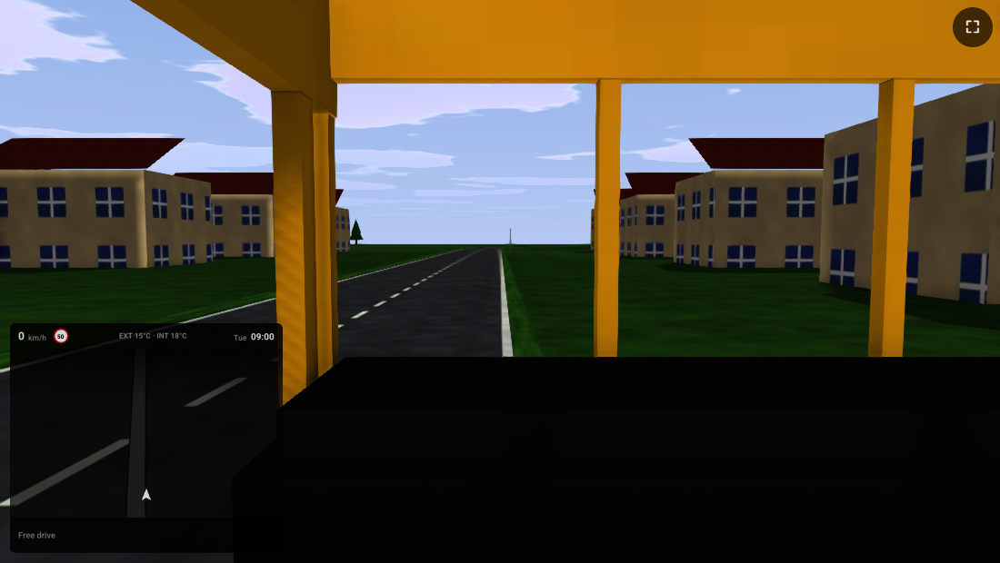
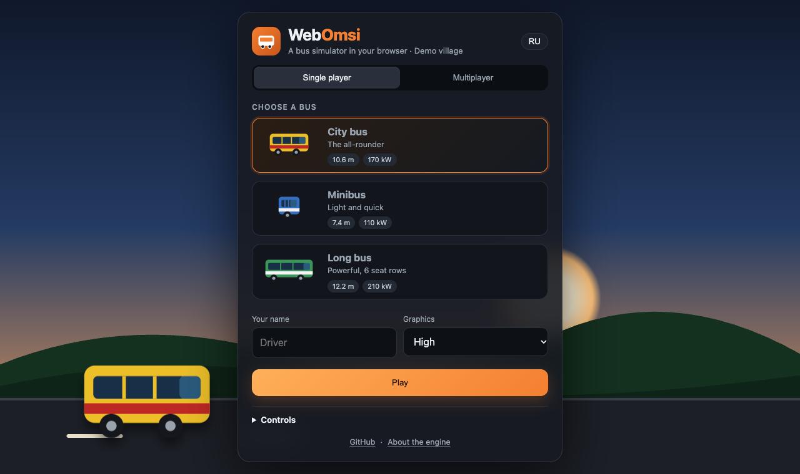
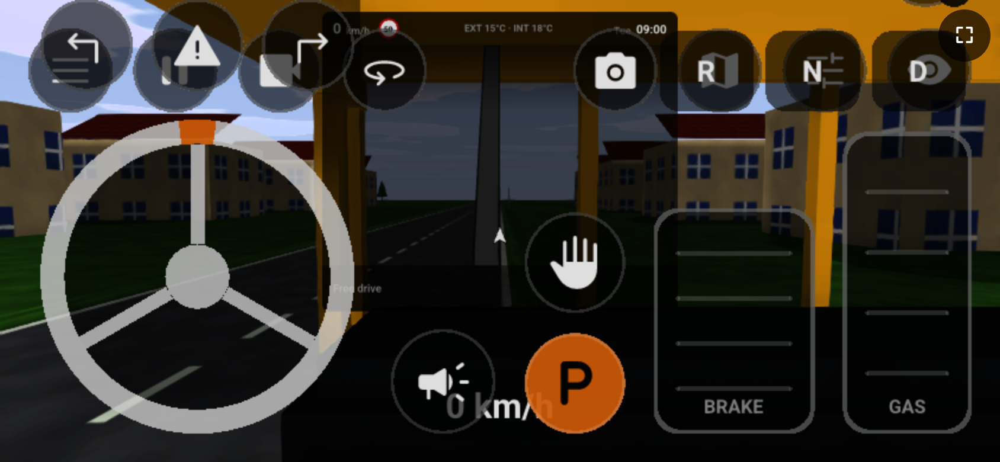
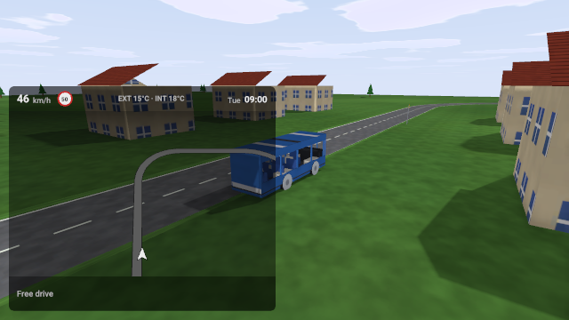
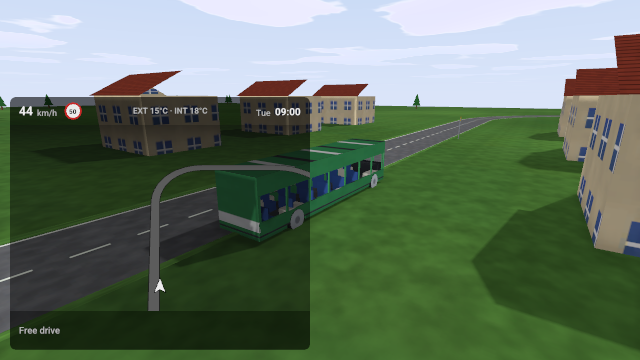
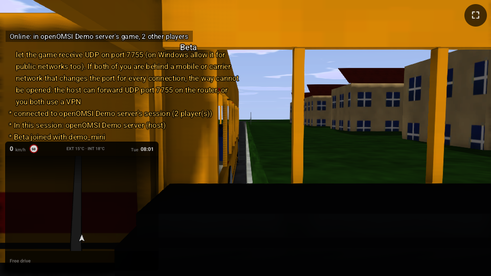
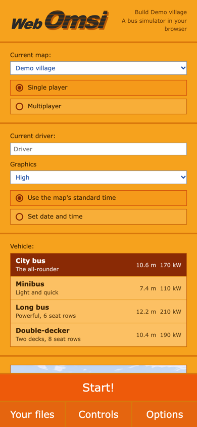

<div align="center">


# WebOmsi

**A bus simulator that runs in your browser.**<br>
Multiplayer, touch controls for phones, nothing to install.

[**▶ Play now**](https://lakomoor.github.io/WebOmsi/) &nbsp;·&nbsp; [Русская версия](README.ru.md) &nbsp;·&nbsp; [Engine docs](https://lakomoor.github.io/WebOmsi/engine/)




</div>

WebOmsi is a fork of [openOMSI](https://github.com/openOMSI-Project/openOMSI), the Rust recreation of the
bus simulator OMSI 2, ported to run in a web page. The simulation, the renderer, the script engine and the
multiplayer protocol are the engine's own; what is new is everything that lets them live in a browser, and a
small original game to play right away.

## Play

Open **<https://lakomoor.github.io/WebOmsi/>** in Chrome or Edge (on a phone: Chrome for Android), pick a
bus and press **Play**. The first start downloads the engine (about 23 MB, 7 MB compressed); the demo content is
160 KB. Both are cached by the browser.

| | |
|---|---|
|  |  |
| A start screen in English and Russian, bus cards, graphics presets | Steering wheel, pedals, gearbox, doors, indicators and horn on the screen |

**You need** a browser with [WebGPU](https://caniuse.com/webgpu): Chrome or Edge 113+ on a computer, Chrome on
Android. Safari and Firefox are not supported yet (they ship WebGPU only in some versions).

### Controls

| Keyboard | |
|---|---|
| `W` / `S` | gas / brake |
| `A` / `D` | steering |
| `Space` | parking brake |
| `Shift+U` | start the bus (stock OMSI buses) |
| `Shift+1` … | open and close doors |
| `H` | horn |
| `Z` `X` `C` | indicators, hazard lights |
| `F1` … | cameras (cab, outside, passengers) |
| `Esc` | game menu |

On a touch screen the game draws its own controls: a steering wheel on the left, **BRAKE** and **GAS** on the
right, buttons for the gearbox (**R N D**), doors, indicators, horn and parking brake (**P**). Drag with a finger to
look around, pinch to zoom. Turn the phone sideways; the page asks for full screen by itself.

## The demo game

The published page plays a small game that is original from the first byte: the village **Demo** (a loop of road,
houses, trees, a bus stop) and four buses. Nothing in it comes from OMSI 2 or any other game: every texture, mesh,
map file and script is generated by [`tools/public`](tools/public) from code, and dedicated to the public domain
([CC0](https://creativecommons.org/publicdomain/zero/1.0/)).

| City bus | Minibus | Long bus |
|---|---|---|
|  |  |  |
| 10.6 m, 170 kW | 7.4 m, 110 kW | 12.2 m, 210 kW |

There is also a double-decker (10.4 m, 190 kW) with seats on both decks.

The buses use real OMSI vehicle files (`.bus`, model config, `.o3d` meshes, `.osc` scripts), so the demo is also a
small example of the formats. Rebuild it with `tools/public/build.sh`; change a number in
[`gen_bus.py`](tools/public/gen_bus.py) and you have another bus.

## Multiplayer



Players meet on a **dedicated server**. A page cannot open a UDP socket, so it talks to the server's WebSocket
gateway (`wss://…/ws`) instead; the server sees such a player like any other and the game protocol is unchanged.
Everybody sees the others' buses, names and chat.

Join: choose **Multiplayer** on the start screen and paste the address.

Host (a computer with a few spare CPU cores is enough):

```sh
# 1. build the game for your system (once)
cargo build --release -p omsi-app
# 2. make the demo content
tools/public/build.sh
# 3. start the server
OMSI_TRIMMED_PACK=1 target/release/openomsi --root public-pack --server server.cfg
```

The first start writes `server.cfg`; set `map = maps/Demo/global.cfg`, and `tunnel = 1` if you have no public
address: the server then opens a free Cloudflare tunnel and prints an `https://….trycloudflare.com` address for the
players (a page served over https needs a `wss://` address, and a tunnel gives one). More in
[docs/SERVER.md](docs/SERVER.md). You can list your servers for the start screen in
[`web/config.json`](web/config.json) (`"servers": [{ "name": "…", "url": "wss://…" }]`).

<br clear="right">

## Your own files

The start screen has a section **Your own files**: drop in zip files with a map, a bus, scenery or a whole OMSI folder,
and they are played together with the built-in game. The page reads each zip and lists the maps and buses it finds;
the files stay in your browser's own storage and are never uploaded.



* a mod **as you downloaded it** works unchanged, also inside a wrapper folder such as `OMSI 2/Vehicles/...`;
* the game sees all your zips as one folder, so a map zip and a bus zip can be separate files;
* a bus that borrows scripts or textures of another add-on needs that add-on in a zip too.

[**Step-by-step guide →**](docs/webomsi/own-content.md) (what a zip may hold, how to cut a small zip out of your OMSI 2 with
[`tools/pack/make_pack.py`](tools/pack/make_pack.py), size limits, what the console messages mean).

OMSI 2's own files and most mods are not ours to give away, so they are never part of this site: please add only
content you have the right to use, and do not publish OMSI 2's files. WebOmsi is not affiliated with the makers of
OMSI 2.

<br clear="right">

## Build it yourself

You need [Rust](https://rustup.rs) (the toolchain `1.97.1`: `rustup toolchain install 1.97.1`), its WebAssembly
target, `wasm-bindgen` and Python 3.

```sh
rustup target add wasm32-unknown-unknown --toolchain 1.97.1
cargo +1.97.1 install wasm-bindgen-cli --version 0.2.128 --locked

tools/public/build.sh          # the demo content -> web/demo-pack.zip
./build-web.sh                 # the game for the browser -> web/pkg   (about 6 minutes)
cd web && python3 -m http.server 8080
```

Open <http://localhost:8080>. Add `?touch=1` to try the touch controls on a computer, `?server=wss://…/ws` to join a
server, `?quality=low` for the light graphics preset.

**Publishing your own copy** takes three steps: fork this repository, set *Settings → Pages → Source* to
*GitHub Actions*, push to `main`. [`pages.yml`](.github/workflows/pages.yml) builds the game and the demo content and
publishes the page at `https://<you>.github.io/<repo>/`.

## How it works

The web port is a set of changes to the engine, none of which changes what the desktop game does:

| Problem in a browser | What WebOmsi does |
|---|---|
| No file system | The game's files are one zip held in memory and mounted as a folder (`omsi_cfg::vfs::mount_zip_memory`). |
| GPU setup is asynchronous | `web::start` opens the WebGPU device first, then runs the winit event loop on the page's canvas. |
| No threads | Tile loading, sky computation and texture work run inline; rayon pools use the page's own thread. |
| No UDP | `omsi_net::Socket` is UDP on a computer and a WebSocket in a page; the session code is unchanged. |
| No audio device | cpal's Web Audio backend. |
| Chrome's strict WGSL | The shaders are checked by Tint; derivatives in non-uniform flow are allowed explicitly. |
| `Instant`, process ids, sleeping | `web-time`, `omsi_cfg::pid()`, `omsi_cfg::sleep()`. |
| Native-only dependencies (plugins, updater, clipboard, file dialogs) | Stand-in crates and `cfg(target_arch = "wasm32")` gates; the launcher compiles but is not used. |

The engine, the crates and the format documentation ([docs/FORMATS.md](docs/FORMATS.md)) are upstream's.

## Known limits

* One thread: loading the map takes a few seconds, during which the page does not respond.
* The first frame compiles shaders; on some systems Chrome's shader compiler fails under load and the game falls back
  to rendering without multisampling.
* The demo has no AI traffic and no passengers; the engine supports both for maps that define them.
* Plugins (Lua and DLL), Discord, Steam, VR and the launcher are desktop-only.

## Credits and licence

* The engine: [openOMSI](https://github.com/openOMSI-Project/openOMSI) by its contributors (MIT).
* The web port and the demo content: this repository. Code is MIT (see [LICENSE](LICENSE)); the files in `tools/public`
  generate content released under CC0.
* *OMSI 2* is a product of its makers; its content is not included here.
